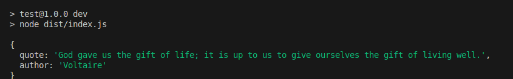

# quote-random-generator [](https://travis-ci.org/kdelmonte/get-random-quote)

Gets a random quote from the Quotable API ([Quotable API](https://api.quotable.io)). Great for giving your team some inspiration after a build :grinning:.



## Features

- Fetches quotes from the Quotable API.
- Provides both the quote text and its author's name.
- Lightweight and easy to integrate into any JavaScript/TypeScript project.
- Great for adding inspirational messages to CI/CD pipelines, websites, or applications.

## Usage

```
import {getRandomQuotes} from "quote-random-generator";

const getQuotes = async () => {
  const data = await getRandomQuotes();
  console.log(data)
        // {
        //    author: 'Edwin Chapin',
        //    quote: 'Every action of our lives touches on some chord that will vibrate in eternity.'
        // }
}

getQuotes();

```

## Installation

Install the package via npm:

`npm i quote-random-generator`

